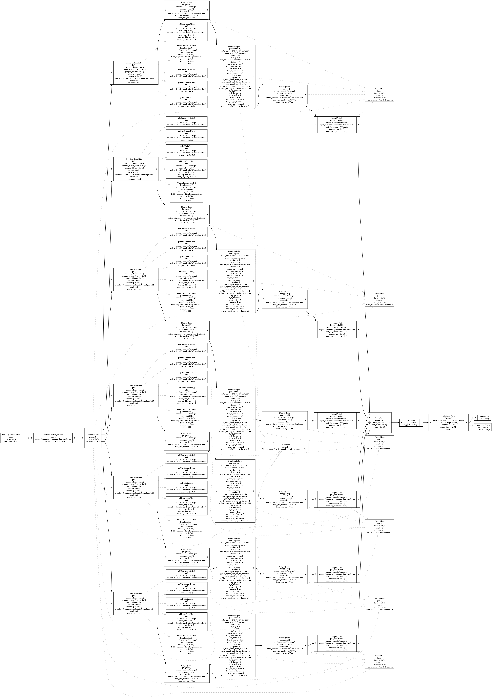

# Examine Program Flow

[[toc]]

Wire-Cell follows the *dataflow programming* paradigm that models a program as a *directed graph* of data flow between operations. The dataflow graph is defined by a top-level jsonnet file. For instance, in the previous ["Explore Real Data"](explore-data) example, Wire-Cell executed [this jsonnet file](https://github.com/WireCell/wire-cell-cfg/blob/master/pgrapher/experiment/pdsp/Quickstart/raw-to-sig.jsonnet) to perform the entire signal processing chain on ProtoDUNE-SP raw data.

## Dump configurations

We can visualize the dataflow graph, which is called **pgraph** in Wire-Cell, to better understand how the program flows. First, we can dump all the configuration into a single *json* file

```bash
jsonnet -V reality=data -V raw_input_label=daq \
    -J cfg cfg/pgrapher/experiment/pdsp/Quickstart/raw-to-sig.jsonnet \
    -o a.json
```
The output `a.json` is a huge JSON file that contains all the pgraph and configuration parameters. It may be difficult to read. Certain tools such as [jq](https://stedolan.github.io/jq/) can be used to parse the JSON file at command line. In the following, we use another tool `wirecell-pgraph` to visualize the pgraph.

::: tip
The `-V` option to `jsonnet` command specifies the values of external variables defined in the jsonnet file by `std.extVar()`. These variables are not set in the jsonnet file itself, but must be passed in by external programs.
:::

## Visualize pgraph

The `wirecell-pgraph` tool relies on the `graphviz` package, so do `sudo apt install graphviz` if it's not installed.
Assuming that you have followed [the previous instruction](explore-data.html#_3d-imaging-experimental) to setup your python virtual environment called `wcpy`. Inside the wcpy environment, do

```bash
wirecell-pgraph dotify --jpath -1 --no-params a.json flow-simple.pdf
```
, which produces the following dataflow graph


Ignoring the several *Magnifysink* nodes which outputs ROOT histograms for debugging, this graph is rather simple and clearly show how the data from 6 APAs are fanned out to be processed individually with the *OminbusNoisefilter* and *OminbusSigProc* nodes, and merged back into the stream after signal processing.

If you omit the `--no-params` option, the output will also contain all the configuration parameter values, resulting a much detailed graph:




<!-- cat a.json | jq '.[] | select{.type=="Pgrapher"}'
cat a.json | jq '.[] | select(.type=="AnodePlane")' -->


<!-- - An directed edge(x, y) connects two nodes from *x* to *y*. *y* is called the *head* and x is called the *tail* of the edge (think of it as an arrow with head and tail). Don't get confused with a linked list where you traverse from head to tail. -->