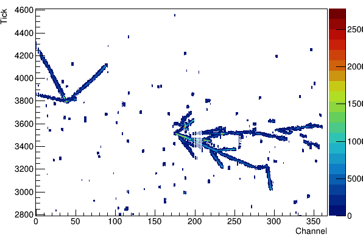

# Simulate Tracks

[[toc]]

## Line charge simulation
To start with an easy example, let's simulate an ideal-line charge in the protoDUNE-SP TPC.
```bash
wire-cell -c pgrapher/experiment/pdsp/wct-sim-check.jsonnet
```

The configuration is available [here](https://github.com/WireCell/wire-cell-cfg/blob/master/pgrapher/experiment/pdsp/wct-sim-check.jsonnet). It is also possible to simulate multiple line charges. For instance, two line charges are simulated in the following example. The charge deposition is set to 2500 electrons per step, and the step length is set to 0.5mm. Therefore, it mimics two MIP tracks with charge deposition of \~5000 e/mm.
```javascript
local cathpier = {
  tail: wc.point(-113, 585, 409, wc.cm),
  head: wc.point( 118,  24, 269, wc.cm),
};

local parallel = {
  tail: wc.point(-1.000, 3.0, 1.000, wc.m),
  head: wc.point(-1.000, 3.0, 2.000, wc.m),
};

local tracklist = [

  {
    time: 0 * wc.us,
    charge: -2500, // 2500 electrons/depo
    ray: cathpier,
  },
  {
    time: 0 * wc.us,
    charge: -2500,
    ray: parallel,
  },
]

local depos = sim.tracks(tracklist, step=0.5 * wc.mm);
```
By runing the example configuration (`wct-sim-check.jsonnet`), a **Magnify** file is obtained. In this example, given the line-charge (electron) depositions in the space and time, the Wire-Cell core simulation is carried out. While more complicated simulations will be introduced below such as userdefined electron depos and realistic charge depos from Geant4 detector simulation.

## Userdefined charge deposition (in JSON format)
To be updated.

## Geant4-simulated charge deposition (LArSoft interface)

### Step 1: Generator
```bash
lar -n1 -c gen_protoDune_pion_7p0GeV_mono.fcl
```
You can get an output file with name similar to `gen_protoDune_pion_7p0GeV_mono.root`. Through `eventdump`, one can see that the generator information is saved in `simb::MCTruth`.

```bash
Begin processing the 1st record. run: 1 subRun: 0 event: 1 at 13-Aug-2019 13:47:55 EDT
PRINCIPAL TYPE: Event
PROCESS NAME | MODULE LABEL.. | PRODUCT INSTANCE NAME | DATA PRODUCT TYPE............ | SIZE
SinglesGen.. | generator..... | ..................... | std::vector<simb::MCTruth>... | ...1
SinglesGen.. | rns........... | ..................... | std::vector<art::RNGsnapshot> | ...1
SinglesGen.. | TriggerResults | ..................... | art::TriggerResults.......... | ...-
```

### Step 2: Geant4
```bash
lar -n1 -c pgrapher/experiment/pdsp/Quickstart/protoDUNE_g4_wirecell.fcl gen_protoDune_pion_7p0GeV_mono.root
```
The Geant4 simulation above requires a photon library data file in a special CVMFS repository (/cvmfs/dune.osgstorage.org/pnfs/fnal.gov/usr/dune/persistent/stash/PhotonPropagation/LibraryData/lib_Protodunev7.root). You have two options to access.
1. Configure the proxy for `dune.osgstorage.gov` by following the instruction in [Install CVMFS](../install)
2. Download the [PhotonPropagation.tar.gz](https://www.phy.bnl.gov/~wgu/wire-cell-tutorial/data/sim/PhotonPropagation.tar.gz), unpack it and set the environment properly to make the directory `PhotonPropagation` available to LArSoft. For example,
```bash
export FW_SEARCH_PATH=$(pwd):$FW_SEARCH_PATH
```

Once the simulation accomplished, you can dump the event information for the output file `gen_protoDune_pion_7p0GeV_mono_g4.root`. Here, the `G4:ionization:vector<sim::SimEnergyDeposit>` is the data product we want to pass to the Wire-Cell simulation.

```bash
Begin processing the 1st record. run: 1 subRun: 0 event: 1 at 13-Aug-2019 13:26:38 CDT
PRINCIPAL TYPE: Event
PROCESS NAME | MODULE LABEL.. | PRODUCT INSTANCE NAME | DATA PRODUCT TYPE.................................................... | .SIZE
SinglesGen.. | generator..... | ..................... | std::vector<simb::MCTruth>........................................... | ....1
SinglesGen.. | rns........... | ..................... | std::vector<art::RNGsnapshot>........................................ | ....1
SinglesGen.. | TriggerResults | ..................... | art::TriggerResults.................................................. | ....-
G4.......... | largeant...... | ..................... | std::vector<sim::OpDetBacktrackerRecord>............................. | ...60
G4.......... | rns........... | ..................... | std::vector<art::RNGsnapshot>........................................ | ....2
G4.......... | largeant...... | Other................ | std::vector<sim::SimEnergyDeposit>................................... | .1168
G4.......... | TriggerResults | ..................... | art::TriggerResults.................................................. | ....-
G4.......... | largeant...... | ..................... | std::vector<simb::MCParticle>........................................ | .2086
G4.......... | largeant...... | ..................... | std::vector<sim::AuxDetSimChannel>................................... | .2048
G4.......... | largeant...... | TPCActive............ | std::vector<sim::SimEnergyDeposit>................................... | 90236
G4.......... | ionization.... | ..................... | std::vector<sim::SimEnergyDeposit>................................... | 90236
G4.......... | largeant...... | ..................... | art::Assns<simb::MCTruth,simb::MCParticle,sim::GeneratedParticleInfo> | .2086
G4.......... | largeant...... | ..................... | std::vector<sim::SimChannel>......................................... | .4010
G4.......... | largeant...... | ..................... | std::vector<sim::SimPhotonsLite>..................................... | ...60
```

### Step 3: Wire-Cell electron drift simulation
```bash
lar -n1 -c pgrapher/experiment/pdsp/Quickstart/wcls-sim-check.fcl gen_protoDune_pion_7p0GeV_mono_g4.root
```
Please check if you can see the raw digit information in the output file: `gen_protoDune_pion_7p0GeV_mono_g4_wcsim.root`.
```bash
wclssim..... | tpcrawdecoder. | daq.................. | std::vector<raw::RawDigit>........................................... | 15360
```

### Step 4: Noise filtering, signal processing and 3D imaging
With the `std::vector<raw::RawDigit>` obtained above, the noise filtering/signal processing and 3D imaging can be performanced in order.
```bash
lar -n1 -c pgrapher/experiment/pdsp/wcls-nf-sp.fcl gen_protoDune_pion_7p0GeV_mono_g4_wcsim.root
```
Here is the 2D display of the deconvolved charge for the above 7-GeV pion interaction.

